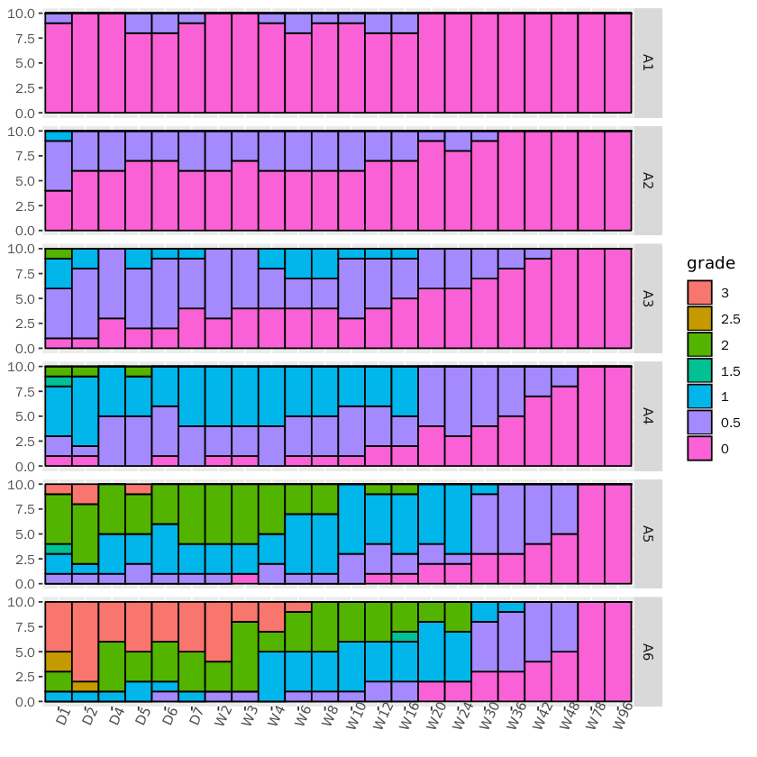
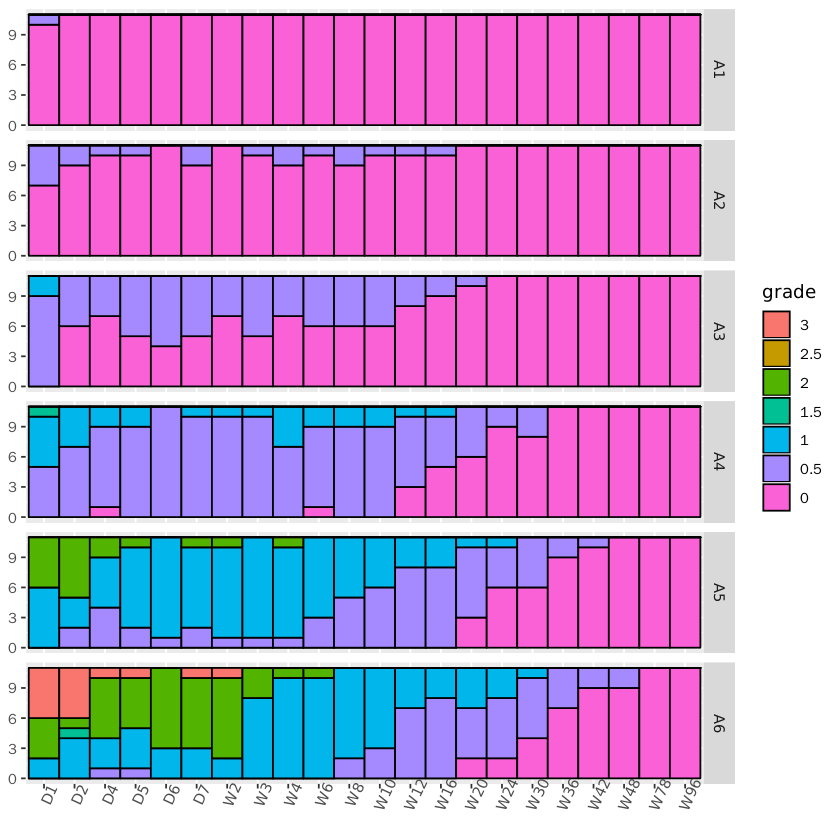
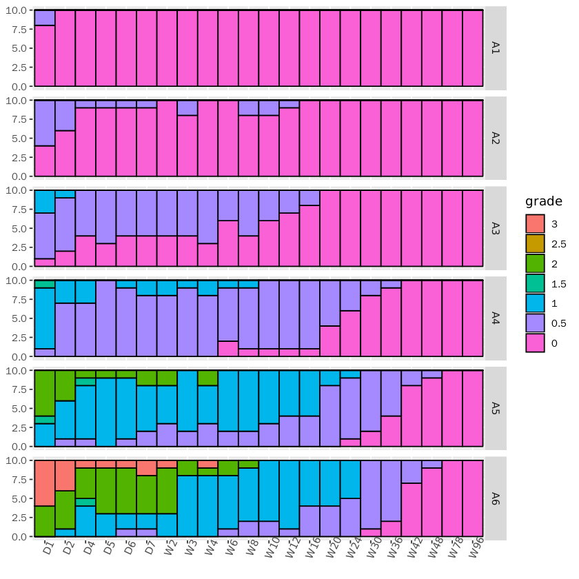

# 聚成三类对医生评价作图
## 1.数据预处理阶段
这里使用python进行处理，pandas库是主要的工具  
先导入数据，查看数据排列结构，并且处理缺失值


```R
import pandas as pd
df = pd.read_excel("grade.xlsx", sheet_name = "E Ye CG", index_col = "MED Ye CG")
df = df.fillna(0)
df.head()
```


<div>
<table border="1" class="dataframe">
  <thead>
    <tr style="text-align: right;">
      <th></th>
      <th>A1_BL_YCG</th>
      <th>A1_D1_YCG</th>
      <th>A1_D2_YCG</th>
      <th>A1_D4_YCG</th>
      <th>A1_D5_YCG</th>
      <th>A1_D6_YCG</th>
      <th>A1_D7_YCG</th>
      <th>A1_W2_YCG</th>
      <th>A1_W3_YCG</th>
      <th>A1_W4_YCG</th>
      <th>...</th>
      <th>A7_W16_YCG</th>
      <th>A7_W20_YCG</th>
      <th>A7_W24_YCG</th>
      <th>A7_W30_YCG</th>
      <th>A7_W36_YCG</th>
      <th>A7_W42_YCG</th>
      <th>A7_W48_YCG</th>
      <th>A7_W78_YCG</th>
      <th>A7_W96_YCG</th>
      <th>hcw</th>
    </tr>
    <tr>
      <th>MED Ye CG</th>
      <th></th>
      <th></th>
      <th></th>
      <th></th>
      <th></th>
      <th></th>
      <th></th>
      <th></th>
      <th></th>
      <th></th>
      <th></th>
      <th></th>
      <th></th>
      <th></th>
      <th></th>
      <th></th>
      <th></th>
      <th></th>
      <th></th>
      <th></th>
      <th></th>
    </tr>
  </thead>
  <tbody>
    <tr>
      <th>1</th>
      <td>0</td>
      <td>0.0</td>
      <td>0</td>
      <td>0</td>
      <td>0.0</td>
      <td>0.0</td>
      <td>0.0</td>
      <td>0</td>
      <td>0</td>
      <td>0.0</td>
      <td>...</td>
      <td>0</td>
      <td>0</td>
      <td>0</td>
      <td>0</td>
      <td>0</td>
      <td>0.0</td>
      <td>0.0</td>
      <td>0</td>
      <td>0</td>
      <td>0</td>
    </tr>
    <tr>
      <th>3</th>
      <td>0</td>
      <td>0.0</td>
      <td>0</td>
      <td>0</td>
      <td>0.0</td>
      <td>0.0</td>
      <td>0.0</td>
      <td>0</td>
      <td>0</td>
      <td>0.0</td>
      <td>...</td>
      <td>0</td>
      <td>0</td>
      <td>0</td>
      <td>0</td>
      <td>0</td>
      <td>0.0</td>
      <td>0.0</td>
      <td>0</td>
      <td>0</td>
      <td>1</td>
    </tr>
    <tr>
      <th>4</th>
      <td>0</td>
      <td>0.0</td>
      <td>0</td>
      <td>0</td>
      <td>0.0</td>
      <td>0.0</td>
      <td>0.0</td>
      <td>0</td>
      <td>0</td>
      <td>0.0</td>
      <td>...</td>
      <td>0</td>
      <td>0</td>
      <td>0</td>
      <td>0</td>
      <td>0</td>
      <td>0.0</td>
      <td>0.0</td>
      <td>0</td>
      <td>0</td>
      <td>1</td>
    </tr>
    <tr>
      <th>6</th>
      <td>0</td>
      <td>0.0</td>
      <td>0</td>
      <td>0</td>
      <td>0.0</td>
      <td>0.0</td>
      <td>0.0</td>
      <td>0</td>
      <td>0</td>
      <td>0.0</td>
      <td>...</td>
      <td>0</td>
      <td>0</td>
      <td>0</td>
      <td>0</td>
      <td>0</td>
      <td>0.0</td>
      <td>0.0</td>
      <td>0</td>
      <td>0</td>
      <td>1</td>
    </tr>
    <tr>
      <th>7</th>
      <td>0</td>
      <td>0.0</td>
      <td>0</td>
      <td>0</td>
      <td>0.0</td>
      <td>0.0</td>
      <td>0.0</td>
      <td>0</td>
      <td>0</td>
      <td>0.0</td>
      <td>...</td>
      <td>0</td>
      <td>0</td>
      <td>0</td>
      <td>0</td>
      <td>0</td>
      <td>0.0</td>
      <td>0.0</td>
      <td>0</td>
      <td>0</td>
      <td>1</td>
    </tr>
  </tbody>
</table>
<p>5 rows × 162 columns</p>
</div>


根据分类信息，也就是表格的最后一列，截取数据子集  
pandas中使用groupby实现，R中使用subset函数实现


```R
df1 = df.groupby('hcw').get_group(0)
df2 = df.groupby('hcw').get_group(1)
df3 = df.groupby('hcw').get_group(2)
```

### 1.1处理第一个分类
#### 1.1.1以A5为例先处理一个孔的数据
将A5变为我们需要的数据格式，先刻画我们需要的数据形式


```R
ks = pd.DataFrame(columns = ['kong', 'day', 'grade', 'freq'])
ks
```


<div>
<table border="1" class="dataframe">
  <thead>
    <tr style="text-align: right;">
      <th></th>
      <th>kong</th>
      <th>day</th>
      <th>grade</th>
      <th>freq</th>
    </tr>
  </thead>
  <tbody>
  </tbody>
</table>
</div>


__各列含义解释：__  
__kong:__ 孔位信息，就是A1～A6，A7是参照系不做考虑  
__day:__ 时间节点信息，D1～W96，(每个孔下22个时间节点)  
__grade:__ 医生评级，对应着7个水平的值，（每个时间节点下的医生有7个评级）  
__freq:__ 每个医生评级对应的频数，（含义：每个孔下某一个时间节点，该时间节点有7个水平的医生评级，每个评级对应着一个频数）

1. 从df1中截取数据，截取A5孔从D1至W96的全部数据


```R
kf = df1.loc[:,'A5_D1_YCG':'A5_W96_YCG']
kf.head()
```


<div>
</style>
<table border="1" class="dataframe">
  <thead>
    <tr style="text-align: right;">
      <th></th>
      <th>A5_D1_YCG</th>
      <th>A5_D2_YCG</th>
      <th>A5_D4_YCG</th>
      <th>A5_D5_YCG</th>
      <th>A5_D6_YCG</th>
      <th>A5_D7_YCG</th>
      <th>A5_W2_YCG</th>
      <th>A5_W3_YCG</th>
      <th>A5_W4_YCG</th>
      <th>A5_W6_YCG</th>
      <th>...</th>
      <th>A5_W12_YCG</th>
      <th>A5_W16_YCG</th>
      <th>A5_W20_YCG</th>
      <th>A5_W24_YCG</th>
      <th>A5_W30_YCG</th>
      <th>A5_W36_YCG</th>
      <th>A5_W42_YCG</th>
      <th>A5_W48_YCG</th>
      <th>A5_W78_YCG</th>
      <th>A5_W96_YCG</th>
    </tr>
    <tr>
      <th>MED Ye CG</th>
      <th></th>
      <th></th>
      <th></th>
      <th></th>
      <th></th>
      <th></th>
      <th></th>
      <th></th>
      <th></th>
      <th></th>
      <th></th>
      <th></th>
      <th></th>
      <th></th>
      <th></th>
      <th></th>
      <th></th>
      <th></th>
      <th></th>
      <th></th>
      <th></th>
    </tr>
  </thead>
  <tbody>
    <tr>
      <th>1</th>
      <td>2.0</td>
      <td>2.0</td>
      <td>1.0</td>
      <td>1.0</td>
      <td>1.0</td>
      <td>1.0</td>
      <td>1.0</td>
      <td>1.0</td>
      <td>1.0</td>
      <td>1.0</td>
      <td>...</td>
      <td>0.5</td>
      <td>1.0</td>
      <td>0.5</td>
      <td>1.0</td>
      <td>0.5</td>
      <td>0.5</td>
      <td>0.5</td>
      <td>0.5</td>
      <td>0</td>
      <td>0</td>
    </tr>
    <tr>
      <th>8</th>
      <td>2.0</td>
      <td>3.0</td>
      <td>2.0</td>
      <td>2.0</td>
      <td>2.0</td>
      <td>2.0</td>
      <td>2.0</td>
      <td>2.0</td>
      <td>2.0</td>
      <td>1.0</td>
      <td>...</td>
      <td>1.0</td>
      <td>2.0</td>
      <td>1.0</td>
      <td>1.0</td>
      <td>0.0</td>
      <td>0.0</td>
      <td>0.0</td>
      <td>0.0</td>
      <td>0</td>
      <td>0</td>
    </tr>
    <tr>
      <th>10</th>
      <td>1.5</td>
      <td>1.0</td>
      <td>1.0</td>
      <td>1.0</td>
      <td>1.0</td>
      <td>1.0</td>
      <td>1.0</td>
      <td>1.0</td>
      <td>1.0</td>
      <td>1.0</td>
      <td>...</td>
      <td>0.5</td>
      <td>0.5</td>
      <td>0.5</td>
      <td>0.5</td>
      <td>0.5</td>
      <td>0.5</td>
      <td>0.5</td>
      <td>0.0</td>
      <td>0</td>
      <td>0</td>
    </tr>
    <tr>
      <th>11</th>
      <td>1.0</td>
      <td>2.0</td>
      <td>2.0</td>
      <td>2.0</td>
      <td>2.0</td>
      <td>2.0</td>
      <td>2.0</td>
      <td>2.0</td>
      <td>2.0</td>
      <td>2.0</td>
      <td>...</td>
      <td>1.0</td>
      <td>1.0</td>
      <td>1.0</td>
      <td>1.0</td>
      <td>0.5</td>
      <td>0.5</td>
      <td>0.0</td>
      <td>0.0</td>
      <td>0</td>
      <td>0</td>
    </tr>
    <tr>
      <th>12</th>
      <td>2.0</td>
      <td>2.0</td>
      <td>2.0</td>
      <td>2.0</td>
      <td>1.0</td>
      <td>2.0</td>
      <td>2.0</td>
      <td>2.0</td>
      <td>2.0</td>
      <td>1.0</td>
      <td>...</td>
      <td>1.0</td>
      <td>1.0</td>
      <td>1.0</td>
      <td>1.0</td>
      <td>0.5</td>
      <td>0.5</td>
      <td>0.5</td>
      <td>0.5</td>
      <td>0</td>
      <td>0</td>
    </tr>
  </tbody>
</table>
<p>5 rows × 22 columns</p>
</div>


2. 统计每一列数据的频数：例如有多少个0，多少个1，多少个2...这一类信息  
使用pandas里series对象的value_counts()方法可以实现计数的功能  
但这里是一个dataframe对象，dataframe对象的每一列又是一个series对象  
所以可以对dataframe的每一列使用value_counts()方法，然后使用dataframe的apply()函数将这个方法用于全部列


```R
kf = kf.apply(lambda x: x.value_counts())
kf
```


<div>
<table border="1" class="dataframe">
  <thead>
    <tr style="text-align: right;">
      <th></th>
      <th>A5_D1_YCG</th>
      <th>A5_D2_YCG</th>
      <th>A5_D4_YCG</th>
      <th>A5_D5_YCG</th>
      <th>A5_D6_YCG</th>
      <th>A5_D7_YCG</th>
      <th>A5_W2_YCG</th>
      <th>A5_W3_YCG</th>
      <th>A5_W4_YCG</th>
      <th>A5_W6_YCG</th>
      <th>...</th>
      <th>A5_W12_YCG</th>
      <th>A5_W16_YCG</th>
      <th>A5_W20_YCG</th>
      <th>A5_W24_YCG</th>
      <th>A5_W30_YCG</th>
      <th>A5_W36_YCG</th>
      <th>A5_W42_YCG</th>
      <th>A5_W48_YCG</th>
      <th>A5_W78_YCG</th>
      <th>A5_W96_YCG</th>
    </tr>
  </thead>
  <tbody>
    <tr>
      <th>0.0</th>
      <td>NaN</td>
      <td>NaN</td>
      <td>NaN</td>
      <td>NaN</td>
      <td>NaN</td>
      <td>NaN</td>
      <td>NaN</td>
      <td>1.0</td>
      <td>NaN</td>
      <td>NaN</td>
      <td>...</td>
      <td>1.0</td>
      <td>1.0</td>
      <td>2.0</td>
      <td>2.0</td>
      <td>3.0</td>
      <td>3.0</td>
      <td>4.0</td>
      <td>5.0</td>
      <td>10.0</td>
      <td>10.0</td>
    </tr>
    <tr>
      <th>0.5</th>
      <td>1.0</td>
      <td>1.0</td>
      <td>1.0</td>
      <td>2.0</td>
      <td>1.0</td>
      <td>1.0</td>
      <td>1.0</td>
      <td>NaN</td>
      <td>2.0</td>
      <td>1.0</td>
      <td>...</td>
      <td>3.0</td>
      <td>2.0</td>
      <td>2.0</td>
      <td>1.0</td>
      <td>6.0</td>
      <td>7.0</td>
      <td>6.0</td>
      <td>5.0</td>
      <td>NaN</td>
      <td>NaN</td>
    </tr>
    <tr>
      <th>1.0</th>
      <td>2.0</td>
      <td>1.0</td>
      <td>4.0</td>
      <td>3.0</td>
      <td>5.0</td>
      <td>3.0</td>
      <td>3.0</td>
      <td>3.0</td>
      <td>3.0</td>
      <td>6.0</td>
      <td>...</td>
      <td>5.0</td>
      <td>6.0</td>
      <td>6.0</td>
      <td>7.0</td>
      <td>1.0</td>
      <td>NaN</td>
      <td>NaN</td>
      <td>NaN</td>
      <td>NaN</td>
      <td>NaN</td>
    </tr>
    <tr>
      <th>1.5</th>
      <td>1.0</td>
      <td>NaN</td>
      <td>NaN</td>
      <td>NaN</td>
      <td>NaN</td>
      <td>NaN</td>
      <td>NaN</td>
      <td>NaN</td>
      <td>NaN</td>
      <td>NaN</td>
      <td>...</td>
      <td>NaN</td>
      <td>NaN</td>
      <td>NaN</td>
      <td>NaN</td>
      <td>NaN</td>
      <td>NaN</td>
      <td>NaN</td>
      <td>NaN</td>
      <td>NaN</td>
      <td>NaN</td>
    </tr>
    <tr>
      <th>2.0</th>
      <td>5.0</td>
      <td>6.0</td>
      <td>5.0</td>
      <td>4.0</td>
      <td>4.0</td>
      <td>6.0</td>
      <td>6.0</td>
      <td>6.0</td>
      <td>5.0</td>
      <td>3.0</td>
      <td>...</td>
      <td>1.0</td>
      <td>1.0</td>
      <td>NaN</td>
      <td>NaN</td>
      <td>NaN</td>
      <td>NaN</td>
      <td>NaN</td>
      <td>NaN</td>
      <td>NaN</td>
      <td>NaN</td>
    </tr>
    <tr>
      <th>3.0</th>
      <td>1.0</td>
      <td>2.0</td>
      <td>NaN</td>
      <td>1.0</td>
      <td>NaN</td>
      <td>NaN</td>
      <td>NaN</td>
      <td>NaN</td>
      <td>NaN</td>
      <td>NaN</td>
      <td>...</td>
      <td>NaN</td>
      <td>NaN</td>
      <td>NaN</td>
      <td>NaN</td>
      <td>NaN</td>
      <td>NaN</td>
      <td>NaN</td>
      <td>NaN</td>
      <td>NaN</td>
      <td>NaN</td>
    </tr>
  </tbody>
</table>
<p>6 rows × 22 columns</p>
</div>


3. 统计数据中虽然把出现过的数字0,0.5,1.0,1.5,2.0,3.0都统计到了，但是其他医生评级数据例如2.5就没有统计到  
   虽然实际上2.5这个评级在该数据集中没出现过，但这个评级应该被统计为0  
   下面解决这个问题,这里使用了datafarme对象的join()方法


```R
grade = pd.DataFrame(index = [0, 0.5, 1, 1.5, 2, 2.5, 3])
kf = grade.join(kf)
kf
```


<div>
<table border="1" class="dataframe">
  <thead>
    <tr style="text-align: right;">
      <th></th>
      <th>A5_D1_YCG</th>
      <th>A5_D2_YCG</th>
      <th>A5_D4_YCG</th>
      <th>A5_D5_YCG</th>
      <th>A5_D6_YCG</th>
      <th>A5_D7_YCG</th>
      <th>A5_W2_YCG</th>
      <th>A5_W3_YCG</th>
      <th>A5_W4_YCG</th>
      <th>A5_W6_YCG</th>
      <th>...</th>
      <th>A5_W12_YCG</th>
      <th>A5_W16_YCG</th>
      <th>A5_W20_YCG</th>
      <th>A5_W24_YCG</th>
      <th>A5_W30_YCG</th>
      <th>A5_W36_YCG</th>
      <th>A5_W42_YCG</th>
      <th>A5_W48_YCG</th>
      <th>A5_W78_YCG</th>
      <th>A5_W96_YCG</th>
    </tr>
  </thead>
  <tbody>
    <tr>
      <th>0.0</th>
      <td>NaN</td>
      <td>NaN</td>
      <td>NaN</td>
      <td>NaN</td>
      <td>NaN</td>
      <td>NaN</td>
      <td>NaN</td>
      <td>1.0</td>
      <td>NaN</td>
      <td>NaN</td>
      <td>...</td>
      <td>1.0</td>
      <td>1.0</td>
      <td>2.0</td>
      <td>2.0</td>
      <td>3.0</td>
      <td>3.0</td>
      <td>4.0</td>
      <td>5.0</td>
      <td>10.0</td>
      <td>10.0</td>
    </tr>
    <tr>
      <th>0.5</th>
      <td>1.0</td>
      <td>1.0</td>
      <td>1.0</td>
      <td>2.0</td>
      <td>1.0</td>
      <td>1.0</td>
      <td>1.0</td>
      <td>NaN</td>
      <td>2.0</td>
      <td>1.0</td>
      <td>...</td>
      <td>3.0</td>
      <td>2.0</td>
      <td>2.0</td>
      <td>1.0</td>
      <td>6.0</td>
      <td>7.0</td>
      <td>6.0</td>
      <td>5.0</td>
      <td>NaN</td>
      <td>NaN</td>
    </tr>
    <tr>
      <th>1.0</th>
      <td>2.0</td>
      <td>1.0</td>
      <td>4.0</td>
      <td>3.0</td>
      <td>5.0</td>
      <td>3.0</td>
      <td>3.0</td>
      <td>3.0</td>
      <td>3.0</td>
      <td>6.0</td>
      <td>...</td>
      <td>5.0</td>
      <td>6.0</td>
      <td>6.0</td>
      <td>7.0</td>
      <td>1.0</td>
      <td>NaN</td>
      <td>NaN</td>
      <td>NaN</td>
      <td>NaN</td>
      <td>NaN</td>
    </tr>
    <tr>
      <th>1.5</th>
      <td>1.0</td>
      <td>NaN</td>
      <td>NaN</td>
      <td>NaN</td>
      <td>NaN</td>
      <td>NaN</td>
      <td>NaN</td>
      <td>NaN</td>
      <td>NaN</td>
      <td>NaN</td>
      <td>...</td>
      <td>NaN</td>
      <td>NaN</td>
      <td>NaN</td>
      <td>NaN</td>
      <td>NaN</td>
      <td>NaN</td>
      <td>NaN</td>
      <td>NaN</td>
      <td>NaN</td>
      <td>NaN</td>
    </tr>
    <tr>
      <th>2.0</th>
      <td>5.0</td>
      <td>6.0</td>
      <td>5.0</td>
      <td>4.0</td>
      <td>4.0</td>
      <td>6.0</td>
      <td>6.0</td>
      <td>6.0</td>
      <td>5.0</td>
      <td>3.0</td>
      <td>...</td>
      <td>1.0</td>
      <td>1.0</td>
      <td>NaN</td>
      <td>NaN</td>
      <td>NaN</td>
      <td>NaN</td>
      <td>NaN</td>
      <td>NaN</td>
      <td>NaN</td>
      <td>NaN</td>
    </tr>
    <tr>
      <th>2.5</th>
      <td>NaN</td>
      <td>NaN</td>
      <td>NaN</td>
      <td>NaN</td>
      <td>NaN</td>
      <td>NaN</td>
      <td>NaN</td>
      <td>NaN</td>
      <td>NaN</td>
      <td>NaN</td>
      <td>...</td>
      <td>NaN</td>
      <td>NaN</td>
      <td>NaN</td>
      <td>NaN</td>
      <td>NaN</td>
      <td>NaN</td>
      <td>NaN</td>
      <td>NaN</td>
      <td>NaN</td>
      <td>NaN</td>
    </tr>
    <tr>
      <th>3.0</th>
      <td>1.0</td>
      <td>2.0</td>
      <td>NaN</td>
      <td>1.0</td>
      <td>NaN</td>
      <td>NaN</td>
      <td>NaN</td>
      <td>NaN</td>
      <td>NaN</td>
      <td>NaN</td>
      <td>...</td>
      <td>NaN</td>
      <td>NaN</td>
      <td>NaN</td>
      <td>NaN</td>
      <td>NaN</td>
      <td>NaN</td>
      <td>NaN</td>
      <td>NaN</td>
      <td>NaN</td>
      <td>NaN</td>
    </tr>
  </tbody>
</table>
<p>7 rows × 22 columns</p>
</div>


4. 数据中有很多NaN，这是因为没有统计到这些数据，从而可以把他们填充为0


```R
kf = kf.fillna(0)
```

5. 在该数据集后面加上一列grade，表示医生的评级信息，实际上该信息和我们的行索引是相同的


```R
kf.loc[:,'grade'] = kf.index
kf
```


<div>
<table border="1" class="dataframe">
  <thead>
    <tr style="text-align: right;">
      <th></th>
      <th>A5_D1_YCG</th>
      <th>A5_D2_YCG</th>
      <th>A5_D4_YCG</th>
      <th>A5_D5_YCG</th>
      <th>A5_D6_YCG</th>
      <th>A5_D7_YCG</th>
      <th>A5_W2_YCG</th>
      <th>A5_W3_YCG</th>
      <th>A5_W4_YCG</th>
      <th>A5_W6_YCG</th>
      <th>...</th>
      <th>A5_W16_YCG</th>
      <th>A5_W20_YCG</th>
      <th>A5_W24_YCG</th>
      <th>A5_W30_YCG</th>
      <th>A5_W36_YCG</th>
      <th>A5_W42_YCG</th>
      <th>A5_W48_YCG</th>
      <th>A5_W78_YCG</th>
      <th>A5_W96_YCG</th>
      <th>grade</th>
    </tr>
  </thead>
  <tbody>
    <tr>
      <th>0.0</th>
      <td>0.0</td>
      <td>0.0</td>
      <td>0.0</td>
      <td>0.0</td>
      <td>0.0</td>
      <td>0.0</td>
      <td>0.0</td>
      <td>1.0</td>
      <td>0.0</td>
      <td>0.0</td>
      <td>...</td>
      <td>1.0</td>
      <td>2.0</td>
      <td>2.0</td>
      <td>3.0</td>
      <td>3.0</td>
      <td>4.0</td>
      <td>5.0</td>
      <td>10.0</td>
      <td>10.0</td>
      <td>0.0</td>
    </tr>
    <tr>
      <th>0.5</th>
      <td>1.0</td>
      <td>1.0</td>
      <td>1.0</td>
      <td>2.0</td>
      <td>1.0</td>
      <td>1.0</td>
      <td>1.0</td>
      <td>0.0</td>
      <td>2.0</td>
      <td>1.0</td>
      <td>...</td>
      <td>2.0</td>
      <td>2.0</td>
      <td>1.0</td>
      <td>6.0</td>
      <td>7.0</td>
      <td>6.0</td>
      <td>5.0</td>
      <td>0.0</td>
      <td>0.0</td>
      <td>0.5</td>
    </tr>
    <tr>
      <th>1.0</th>
      <td>2.0</td>
      <td>1.0</td>
      <td>4.0</td>
      <td>3.0</td>
      <td>5.0</td>
      <td>3.0</td>
      <td>3.0</td>
      <td>3.0</td>
      <td>3.0</td>
      <td>6.0</td>
      <td>...</td>
      <td>6.0</td>
      <td>6.0</td>
      <td>7.0</td>
      <td>1.0</td>
      <td>0.0</td>
      <td>0.0</td>
      <td>0.0</td>
      <td>0.0</td>
      <td>0.0</td>
      <td>1.0</td>
    </tr>
    <tr>
      <th>1.5</th>
      <td>1.0</td>
      <td>0.0</td>
      <td>0.0</td>
      <td>0.0</td>
      <td>0.0</td>
      <td>0.0</td>
      <td>0.0</td>
      <td>0.0</td>
      <td>0.0</td>
      <td>0.0</td>
      <td>...</td>
      <td>0.0</td>
      <td>0.0</td>
      <td>0.0</td>
      <td>0.0</td>
      <td>0.0</td>
      <td>0.0</td>
      <td>0.0</td>
      <td>0.0</td>
      <td>0.0</td>
      <td>1.5</td>
    </tr>
    <tr>
      <th>2.0</th>
      <td>5.0</td>
      <td>6.0</td>
      <td>5.0</td>
      <td>4.0</td>
      <td>4.0</td>
      <td>6.0</td>
      <td>6.0</td>
      <td>6.0</td>
      <td>5.0</td>
      <td>3.0</td>
      <td>...</td>
      <td>1.0</td>
      <td>0.0</td>
      <td>0.0</td>
      <td>0.0</td>
      <td>0.0</td>
      <td>0.0</td>
      <td>0.0</td>
      <td>0.0</td>
      <td>0.0</td>
      <td>2.0</td>
    </tr>
    <tr>
      <th>2.5</th>
      <td>0.0</td>
      <td>0.0</td>
      <td>0.0</td>
      <td>0.0</td>
      <td>0.0</td>
      <td>0.0</td>
      <td>0.0</td>
      <td>0.0</td>
      <td>0.0</td>
      <td>0.0</td>
      <td>...</td>
      <td>0.0</td>
      <td>0.0</td>
      <td>0.0</td>
      <td>0.0</td>
      <td>0.0</td>
      <td>0.0</td>
      <td>0.0</td>
      <td>0.0</td>
      <td>0.0</td>
      <td>2.5</td>
    </tr>
    <tr>
      <th>3.0</th>
      <td>1.0</td>
      <td>2.0</td>
      <td>0.0</td>
      <td>1.0</td>
      <td>0.0</td>
      <td>0.0</td>
      <td>0.0</td>
      <td>0.0</td>
      <td>0.0</td>
      <td>0.0</td>
      <td>...</td>
      <td>0.0</td>
      <td>0.0</td>
      <td>0.0</td>
      <td>0.0</td>
      <td>0.0</td>
      <td>0.0</td>
      <td>0.0</td>
      <td>0.0</td>
      <td>0.0</td>
      <td>3.0</td>
    </tr>
  </tbody>
</table>
<p>7 rows × 23 columns</p>
</div>


6. 化长数据为宽数据，R中reshape包提供了melt()函数，同样pandas中也提供了melt()函数  
   注意：pandas中melt()函数不是对象方法，调用方式是：（`模块名`.`函数名`）  
   melt()函数的参数有：`id_vars`，`var_name` 


```R
pf = pd.melt(kf, id_vars = 'grade', var_name = 'day', value_name = 'freq')
pf.tail()
```


<div>
<table border="1" class="dataframe">
  <thead>
    <tr style="text-align: right;">
      <th></th>
      <th>grade</th>
      <th>day</th>
      <th>freq</th>
    </tr>
  </thead>
  <tbody>
    <tr>
      <th>149</th>
      <td>1.0</td>
      <td>A5_W96_YCG</td>
      <td>0.0</td>
    </tr>
    <tr>
      <th>150</th>
      <td>1.5</td>
      <td>A5_W96_YCG</td>
      <td>0.0</td>
    </tr>
    <tr>
      <th>151</th>
      <td>2.0</td>
      <td>A5_W96_YCG</td>
      <td>0.0</td>
    </tr>
    <tr>
      <th>152</th>
      <td>2.5</td>
      <td>A5_W96_YCG</td>
      <td>0.0</td>
    </tr>
    <tr>
      <th>153</th>
      <td>3.0</td>
      <td>A5_W96_YCG</td>
      <td>0.0</td>
    </tr>
  </tbody>
</table>
</div>


上述操作的含义是：每个grade有一个column值对应的属性，把这个属性命名为'day'，每个属性对应着一个值，把这个值命名为freq  
具体讲就是：医生评级对应一个时点，每个时点对应这这个评级的频数。

7. 完成我们最终需要的数据集合，也就是ks所展现的结构


```R
pf = ks.append(pf, sort=False)
pf.tail(7)
```


<div>
<table border="1" class="dataframe">
  <thead>
    <tr style="text-align: right;">
      <th></th>
      <th>kong</th>
      <th>day</th>
      <th>grade</th>
      <th>freq</th>
    </tr>
  </thead>
  <tbody>
    <tr>
      <th>147</th>
      <td>NaN</td>
      <td>A5_W96_YCG</td>
      <td>0.0</td>
      <td>10.0</td>
    </tr>
    <tr>
      <th>148</th>
      <td>NaN</td>
      <td>A5_W96_YCG</td>
      <td>0.5</td>
      <td>0.0</td>
    </tr>
    <tr>
      <th>149</th>
      <td>NaN</td>
      <td>A5_W96_YCG</td>
      <td>1.0</td>
      <td>0.0</td>
    </tr>
    <tr>
      <th>150</th>
      <td>NaN</td>
      <td>A5_W96_YCG</td>
      <td>1.5</td>
      <td>0.0</td>
    </tr>
    <tr>
      <th>151</th>
      <td>NaN</td>
      <td>A5_W96_YCG</td>
      <td>2.0</td>
      <td>0.0</td>
    </tr>
    <tr>
      <th>152</th>
      <td>NaN</td>
      <td>A5_W96_YCG</td>
      <td>2.5</td>
      <td>0.0</td>
    </tr>
    <tr>
      <th>153</th>
      <td>NaN</td>
      <td>A5_W96_YCG</td>
      <td>3.0</td>
      <td>0.0</td>
    </tr>
  </tbody>
</table>
</div>


8. 添加孔位信息，把孔位信息填充为‘A5’


```R
pf.kong = 'A5'
```

9. 把day的信息进行调整，例如A5_W96_YCG改为W96  
   利用字符串切片功能实现


```R
pf.day = pf.day.apply(lambda x: x[3:-4])
pf.head()
```


<div>
<table border="1" class="dataframe">
  <thead>
    <tr style="text-align: right;">
      <th></th>
      <th>kong</th>
      <th>day</th>
      <th>grade</th>
      <th>freq</th>
    </tr>
  </thead>
  <tbody>
    <tr>
      <th>0</th>
      <td>A5</td>
      <td>D1</td>
      <td>0.0</td>
      <td>0.0</td>
    </tr>
    <tr>
      <th>1</th>
      <td>A5</td>
      <td>D1</td>
      <td>0.5</td>
      <td>1.0</td>
    </tr>
    <tr>
      <th>2</th>
      <td>A5</td>
      <td>D1</td>
      <td>1.0</td>
      <td>2.0</td>
    </tr>
    <tr>
      <th>3</th>
      <td>A5</td>
      <td>D1</td>
      <td>1.5</td>
      <td>1.0</td>
    </tr>
    <tr>
      <th>4</th>
      <td>A5</td>
      <td>D1</td>
      <td>2.0</td>
      <td>5.0</td>
    </tr>
  </tbody>
</table>
</div>


### 1.2设计循环处理所有的孔位
上面我们成功地将数据变成了我们想要的结构  
但是我们只处理了一个孔位的数据，现在我们需要处理6个孔的全部数据  
df1是第一类人群的全部数据，我们以df1作为处理的起点

第一步：存储数据的容器——需要一个容器存储数据


```R
ct = pd.DataFrame(columns=['kong','day','grade','freq'])
```

第二步：循环迭代，主要切片循环机制的设计


```R
for i in range(1,7):
    cf = df1.loc[:,'A'+str(i)+'_D1_YCG':'A'+str(i)+'_W96_YCG']
    cf = cf.apply(lambda x: x.value_counts())
    grade = pd.DataFrame(index=[0,0.5,1,1.5,2,2.5,3])
    cf = grade.join(cf, sort=False)
    cf = cf.fillna(0)
    cf.loc[:,'grade'] = cf.index
    cf = pd.melt(cf, id_vars='grade', var_name='day', value_name='freq')
    col = pd.DataFrame(columns=['kong','day','grade','freq'])
    cf = col.append(cf, sort=False)
    cf.day = cf.day.apply(lambda x: x[3:-4])
    cf.kong = 'A'+str(i)
    ct = ct.append(cf, sort=False)
```


```R
ct.tail()
```


<div>
<table border="1" class="dataframe">
  <thead>
    <tr style="text-align: right;">
      <th></th>
      <th>kong</th>
      <th>day</th>
      <th>grade</th>
      <th>freq</th>
    </tr>
  </thead>
  <tbody>
    <tr>
      <th>149</th>
      <td>A6</td>
      <td>W96</td>
      <td>1.0</td>
      <td>0.0</td>
    </tr>
    <tr>
      <th>150</th>
      <td>A6</td>
      <td>W96</td>
      <td>1.5</td>
      <td>0.0</td>
    </tr>
    <tr>
      <th>151</th>
      <td>A6</td>
      <td>W96</td>
      <td>2.0</td>
      <td>0.0</td>
    </tr>
    <tr>
      <th>152</th>
      <td>A6</td>
      <td>W96</td>
      <td>2.5</td>
      <td>0.0</td>
    </tr>
    <tr>
      <th>153</th>
      <td>A6</td>
      <td>W96</td>
      <td>3.0</td>
      <td>0.0</td>
    </tr>
  </tbody>
</table>
</div>


### 1.3完成其他类人群数据的读取
其实是上面代码重复  
__第二类人群的数据处理__


```R
at = pd.DataFrame(columns=['kong','day','grade','freq'])#要修改容器
for i in range(1,7):
    cf = df2.loc[:,'A'+str(i)+'_D1_YCG':'A'+str(i)+'_W96_YCG']#需要修改
    cf = cf.apply(lambda x: x.value_counts())
    grade = pd.DataFrame(index=[0,0.5,1,1.5,2,2.5,3])
    cf = grade.join(cf, sort=False)
    cf = cf.fillna(0)
    cf.loc[:,'grade'] = cf.index
    cf = pd.melt(cf, id_vars='grade', var_name='day', value_name='freq')
    col = pd.DataFrame(columns=['kong','day','grade','freq'])
    cf = col.append(cf, sort=False)
    cf.day = cf.day.apply(lambda x: x[3:-4])
    cf.kong = 'A'+str(i)
    at = at.append(cf, sort=False)#要修改容器
at.head()
```


<div>
<table border="1" class="dataframe">
  <thead>
    <tr style="text-align: right;">
      <th></th>
      <th>kong</th>
      <th>day</th>
      <th>grade</th>
      <th>freq</th>
    </tr>
  </thead>
  <tbody>
    <tr>
      <th>0</th>
      <td>A1</td>
      <td>D1</td>
      <td>0.0</td>
      <td>10.0</td>
    </tr>
    <tr>
      <th>1</th>
      <td>A1</td>
      <td>D1</td>
      <td>0.5</td>
      <td>1.0</td>
    </tr>
    <tr>
      <th>2</th>
      <td>A1</td>
      <td>D1</td>
      <td>1.0</td>
      <td>0.0</td>
    </tr>
    <tr>
      <th>3</th>
      <td>A1</td>
      <td>D1</td>
      <td>1.5</td>
      <td>0.0</td>
    </tr>
    <tr>
      <th>4</th>
      <td>A1</td>
      <td>D1</td>
      <td>2.0</td>
      <td>0.0</td>
    </tr>
  </tbody>
</table>
</div>


__第三类人群的数据处理__


```R
bt = pd.DataFrame(columns=['kong','day','grade','freq'])#要修改容器
for i in range(1,7):
    cf = df3.loc[:,'A'+str(i)+'_D1_YCG':'A'+str(i)+'_W96_YCG']#需要修改
    cf = cf.apply(lambda x: x.value_counts())
    grade = pd.DataFrame(index=[0,0.5,1,1.5,2,2.5,3])
    cf = grade.join(cf, sort=False)
    cf = cf.fillna(0)
    cf.loc[:,'grade'] = cf.index
    cf = pd.melt(cf, id_vars='grade', var_name='day', value_name='freq')
    col = pd.DataFrame(columns=['kong','day','grade','freq'])
    cf = col.append(cf, sort=False)
    cf.day = cf.day.apply(lambda x: x[3:-4])
    cf.kong = 'A'+str(i)
    bt = bt.append(cf, sort=False)#修改容器
bt.tail()
```


<div>
<table border="1" class="dataframe">
  <thead>
    <tr style="text-align: right;">
      <th></th>
      <th>kong</th>
      <th>day</th>
      <th>grade</th>
      <th>freq</th>
    </tr>
  </thead>
  <tbody>
    <tr>
      <th>149</th>
      <td>A6</td>
      <td>W96</td>
      <td>1.0</td>
      <td>0.0</td>
    </tr>
    <tr>
      <th>150</th>
      <td>A6</td>
      <td>W96</td>
      <td>1.5</td>
      <td>0.0</td>
    </tr>
    <tr>
      <th>151</th>
      <td>A6</td>
      <td>W96</td>
      <td>2.0</td>
      <td>0.0</td>
    </tr>
    <tr>
      <th>152</th>
      <td>A6</td>
      <td>W96</td>
      <td>2.5</td>
      <td>0.0</td>
    </tr>
    <tr>
      <th>153</th>
      <td>A6</td>
      <td>W96</td>
      <td>3.0</td>
      <td>0.0</td>
    </tr>
  </tbody>
</table>
</div>


## 2.画图——数据准备阶段
上面的数据预处理已经解决了数据的格式问题。现在，我们要在R中使用ggplot2进行作图，涉及到从pandas的dataframe到R的dataframe，也涉及从python到R的转换。  
这里采用的策略是把我们之前处理好的数据写入磁盘，然后用R程序再次从文件中读取。


```R
ct.to_csv('ou1.csv')
at.to_csv('ou2.csv')
bt.to_csv('ou3.csv')
```

切换服务jupyter的程序为R，用R提供的函数读取三个`.csv`文件


```R
df1 <- read.table('ou1.csv', sep = ',', header = TRUE)
df2 <- read.table('ou2.csv', sep = ',', header = TRUE)
df3 <- read.table('ou3.csv', sep = ',', header = TRUE)
```


```R
head(df1)
```


<table>
<thead><tr><th scope=col>X</th><th scope=col>kong</th><th scope=col>day</th><th scope=col>grade</th><th scope=col>freq</th></tr></thead>
<tbody>
	<tr><td>0  </td><td>A1 </td><td>D1 </td><td>0.0</td><td>9  </td></tr>
	<tr><td>1  </td><td>A1 </td><td>D1 </td><td>0.5</td><td>1  </td></tr>
	<tr><td>2  </td><td>A1 </td><td>D1 </td><td>1.0</td><td>0  </td></tr>
	<tr><td>3  </td><td>A1 </td><td>D1 </td><td>1.5</td><td>0  </td></tr>
	<tr><td>4  </td><td>A1 </td><td>D1 </td><td>2.0</td><td>0  </td></tr>
	<tr><td>5  </td><td>A1 </td><td>D1 </td><td>2.5</td><td>0  </td></tr>
</tbody>
</table>


其中X是多余的列，产生于pandas数据框保存为csv文件过程中，需要去除


```R
df1 <- subset(df1, select = -X)
df2 <- subset(df2, select = -X)
df3 <- subset(df3, select = -X)
```


```R
tail(df1)
```


<table>
<thead><tr><th></th><th scope=col>kong</th><th scope=col>day</th><th scope=col>grade</th><th scope=col>freq</th></tr></thead>
<tbody>
	<tr><th scope=row>919</th><td>A6 </td><td>W96</td><td>0.5</td><td>0  </td></tr>
	<tr><th scope=row>920</th><td>A6 </td><td>W96</td><td>1.0</td><td>0  </td></tr>
	<tr><th scope=row>921</th><td>A6 </td><td>W96</td><td>1.5</td><td>0  </td></tr>
	<tr><th scope=row>922</th><td>A6 </td><td>W96</td><td>2.0</td><td>0  </td></tr>
	<tr><th scope=row>923</th><td>A6 </td><td>W96</td><td>2.5</td><td>0  </td></tr>
	<tr><th scope=row>924</th><td>A6 </td><td>W96</td><td>3.0</td><td>0  </td></tr>
</tbody>
</table>


设定day的因子水平


```R
lev <- c('D1','D2','D4','D5','D6','D7','W2','W3','W4','W6','W8','W10','W12','W16','W20','W24','W30','W36','W42','W48','W78','W96')
df1$day <- factor(df1$day, levels = lev)
df2$day <- factor(df2$day, levels = lev)
df3$day <- factor(df3$day, levels = lev)
```

设定grade的因子水平


```R
grade <- c(3,2.5,2,1.5,1,0.5,0)
df1$grade <- factor(df1$grade, levels = grade)
df2$grade <- factor(df2$grade, levels = grade)
df3$grade <- factor(df3$grade, levels = grade)
```

## 3.画图
### 3.1画其中第一幅图
1. 导入ggplot2包


```R
library(ggplot2)
```

2. 创建ggplot对象


```R
p1 <- ggplot(df1, aes(x = day, y = freq, fill = grade))
```

3. 添加几何对象为bar，方法为identity


```R
p1 <- p1 + geom_bar(stat = 'identity', width = 1, colour = "black")
```

4. 按照kong进行分面


```R
p1 <- p1 + facet_grid(kong ~ .)
```

5. 美化：去除x轴和y轴的label，同时修改刻度文字的排列


```R
p1 + theme(axis.text.x = element_text(angle = 65)) + theme(axis.title = element_blank())
```





### 3.2对所有数据作图


```R
ggplot(df2, aes(x = day, y = freq, fill = grade)) + 
geom_bar(stat = 'identity',width = 1, colour = "black") + facet_grid(kong ~ .) + 
theme(axis.text.x = element_text(angle = 65)) + 
theme(axis.title = element_blank())
```





```R
ggplot(df3, aes(x = day, y = freq, fill = grade)) + 
geom_bar(stat = 'identity', width = 1, colour = "black") + facet_grid(kong ~ .) + 
theme(axis.text.x = element_text(angle = 65)) + 
theme(axis.title = element_blank())
```





## 4.总结
__关键:__ 理解ggplot2的作图才是本文的关键，我们最终需要的图：横坐标是每一个时间点，纵轴表示的是频数，颜色映射的是医生评级。从而这就决定了，我们所需数据表的格式，表示时间点的day因子（顺序有实际意义），表示医生某一个评级的频数freq，频数对应的医生评级是多少。  
__注意:__ 上述的关键点才是，我思考这个问题的方式，就是先考虑怎么用ggplot2画图，然后再考虑需要什么样子的dataframe格式。最后就是，用相关工具去实现这样的dataframe。__先考虑ggplot2画图怎么实现的，然后就是构造符合要求的data。__
