# mysql学习和使用
---
## 1.1初次登录进入（以root用户进入）
---
1. 登录进入root用户
&nbsp;
```shell
sudo mysql -u root -p
```
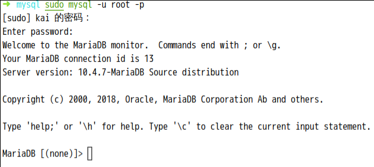
&nbsp;
+ 一般登录方式
```shell
sudo mysql -u UserName -p
```
&nbsp;
+ **补充：**远程登录
```shell
sudo mysql -h IpOfHost -u UserName -p
```
&nbsp;
&nbsp;
2. 创建一般用户
```sql
 CREATE USER 'monty'@'localhost' IDENTIFIED BY 'some_pass';
 CREATE USER 'monty'@'%' IDENTIFIED BY 'some_pass';
```
__注:__ 含义是创建了用户名为monty，密码为some_pass的普通账户  
__注:__@后面的ip地址为__允许__连接的客户端的ip地址，如果改为 '%'，就表示客户端没有ip地址的限制。
```sql
 GRANT ALL PRIVILEGES ON mydb.* TO 'monty'@'localhost'
```
__注:__ 赋予新用户，从本地操作所有数据库.所有数据表的所有权限
```sql
 GRANT ALL PRIVILEGES ON mydb.* TO 'monty'@'%'
```
__注:__ 赋予新用户，从外部操作所有数据库.所有数据表的所有权限（没有外部客户端的IP限制，但本地有限制）
&nbsp;
&nbsp;
+ 创建用户时，如果后面是@'127.0.0.1'，则只能从本地连接。
+ 创建用户时，如果后面是@'%'，就可以从外部（局域网或外网）连接；而且还可以从本地连接，且没有密码。
+ 创建用户后，该用户就可以连接MySQL了，但默认什么权限都没有，想要操作数据库，就必须进行授权。
+ 创建用户时，实际上是在mysql.user表中添加一条记录，Host（客户端地址）和User（用户名）共同确定记录的唯一性。
+ 授权时，如果对应的记录（客户端地址和用户名）已经存在，就更新该记录；否则，会添加一条记录。
+ 创建用户和授权，实际上都是操作mysql.user表。
+ 综上所述，如果想给某个不存在的用户赋予数据库操作权限，只需一条授权命令即可。
```sql
grant all privileges on *.* to 'test'@'%' identified by '666666';
# 只执行这条授权命令，会在授权的同时，创建test用户。
# test用户，可以从外部连接MySQL（需要输入密码），具备所有权限。
# test用户，也可以从本地连接MySQL（不能输入密码），只能连接，不具备数据库操作权限。
# 如果想让test用户，在本地也具备所有权限，且用同样的密码，再授权一次即可。如下：
grant all privileges on *.* to 'test'@'127.0.0.1' identified by '666666';
```
&nbsp;
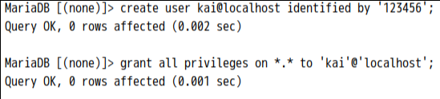
&nbsp;
&nbsp;
3. 退出root用户
```Shell
quit or exit
```
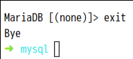
&nbsp;
&nbsp;
## 1.2用普通账户(DDL语句)
---
1. 登入普通用户
```Shell
sudo mysql -u kai -p
```
&nbsp;
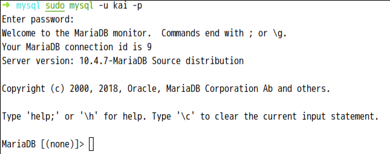
&nbsp;
&nbsp;

2. DDL语句（创建数据库）
```sql
create database NameOfDatabase;--创建数据库
create database if not exists NameOfDatabase;--判断数据库是否存在，如果不存在则建立库
create database NameOfDatabase character set NameOfCharacterSet;--创建数据库并且指定字符集
```
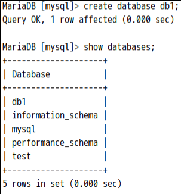

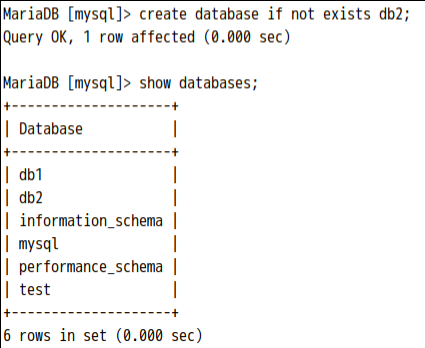


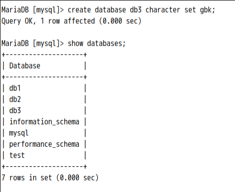


```sql
show create database db1;--显示数据库的定义信息
show create database db3;
```
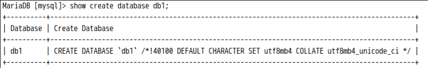

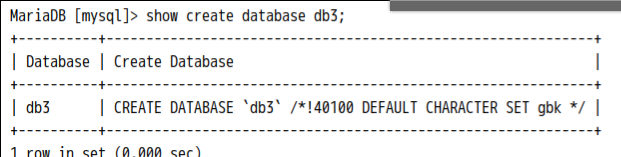


```sql
alter database db3 character set utf8;--修改db3的默认字符集为utf9
```
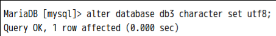

```sql
drop database db2;--删除数据库db2
```
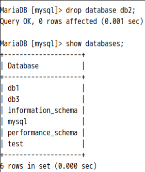

```sql
select database();--查看正在使用的数据库
```
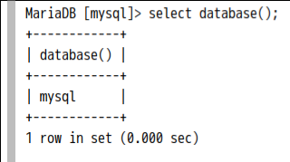

```sql
use NameOfDatabase;--使用/切换数据库
```
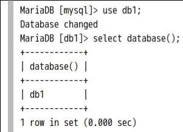

3. DDL语句创建数据表
+ ***注意是在数据库中创建数据表***

```sql
create table student(
    id int,--整数
    name varchar(20),--字符串
    birthday date--日期，没有逗号
)
```
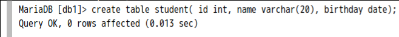

```sql
desc student;--描述表的结构
show create table student;--查看创建表的sql语句
```
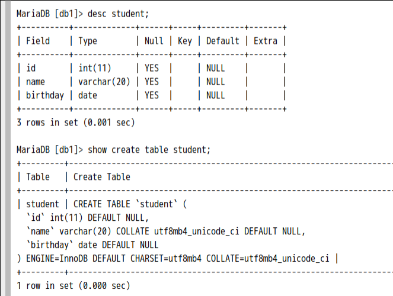

```sql
create table stu1 like student;--创建一个结构相同的表
```
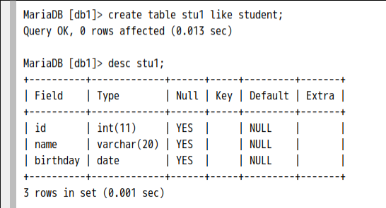

```sql
drop table if exists student;--判断表是否存在，如果存在则删除
drop table student;--删除表
```
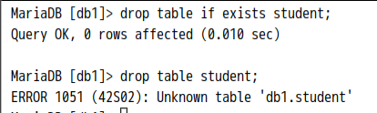

```sql
alter table stu1 add remark varchar(20);--为表stu1添加一列remark，该列类型是varchar；
```
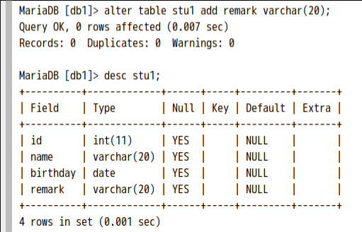

```sql
alter table stu1 modify remark varchar(100);--修改列remark的类型
```
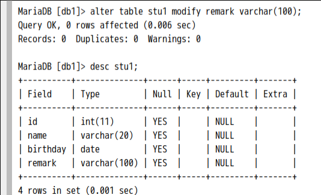

```sql
alter table stu1 change remark info varchar(20);--修改remark列的列名为info，修改列的类型为varchar(20)
```
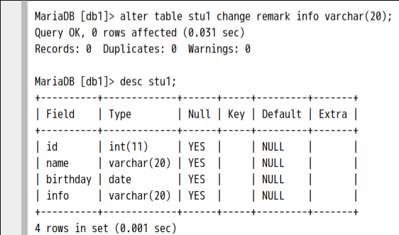

```sql
alter table stu1 drop id;--删除表stu1的id列
```
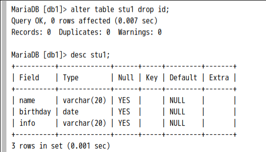

```sql
rename table stu1 to stu;--重命名
```
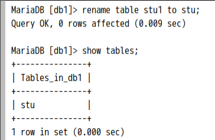

```sql
alter table stu character set gbk;--修改表格的字符集
```
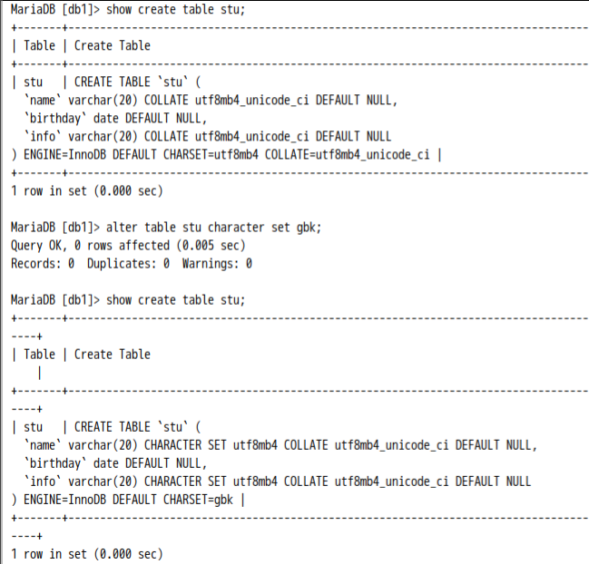