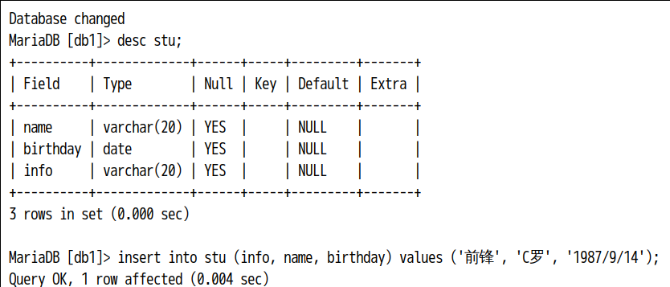
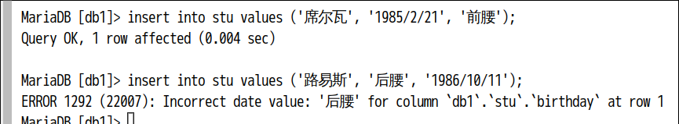
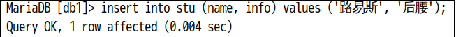
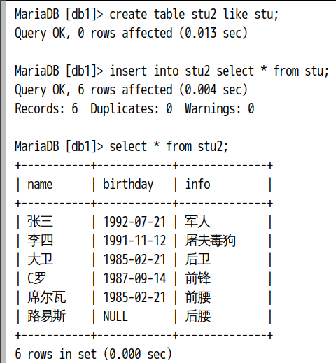

# DML语句

+ ___用于增删改表中的数据___

1. 插入记录
---
```sql
insert into stu (name, birthday, info) values ('李四', '1991/11/12', '屠夫毒狗');--给表stu插入一条记录,，把所有字段名写出来(顺序可变)
```


```sql
insert into stu values ('大卫', '1985/2/21', '后卫');--不给出对应字段，向表stu插入数据（不能打乱顺序），顺序需要按照表格的字段顺序
```


```sql
insert into stu (name, info) values ('路易斯', '后腰');--插入部分数据，没有的数据自动填上NULL，必须写列名
```


__insert的注意事项：__  
1)插入的数据应与字段的数据类型相同  
2)数据的大小应在列的规定范围内，例如：不能将一个长度为80的字符串加入到长度为40的列中。  
3)在values中列出的数据位置必须与被加入的列的排列位置相对应。在mysql中可以使用value，但不建议使用，功能与values相同。  
4)字符和日期型数据应包含在单引号中。MySQL中也可以使用双引号做为分隔符。  
5)不指定列或使用null，表示插入空值。

2. 复制
---

```sql
--创建stu2表，stu2结构和stu表结构一样
create table stu2 like stu;
--将student表中的数据添加到student2表中
insert into stu2 select * from stu;
--如果只想复制student表中name,age字段数据到student2表中，两张表都写出相应的列名
insert into stu2 (name,age) select name,age from stu;

select * from stu2;
```


3. 更新
---
```sql
update NameOfTable set NameOfField=value;--不带条件将表中的一列改为一个固定值
update NameOfTable set NameOfField=value where 条件表达式;--带条件的更新列表值
update student set age=26,address='北京' where id=3;--一次修改多个列，把id为3的学生，年龄改成26岁，address改成北京
```

4. 删除
---
```sql
--带条件删除数据，删除id为1的记录 
delete from student where id=1;

--不带条件删除数据,删除表中的所有数据
delete from student;
```


```python

```
